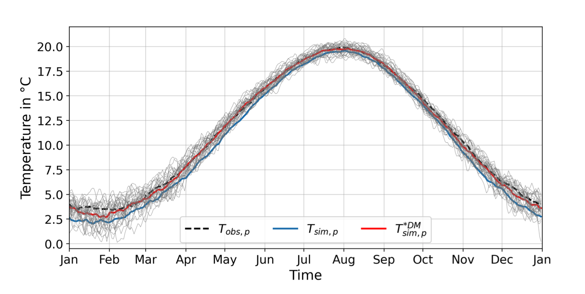

BiasAdjustCXX command-line tool for the application of fast and efficient bias corrections in climatic research
===============================================================================================================

.. BADGES
.. |GitHub badge| image:: https://badgen.net/badge/icon/github?icon=github&label
   :target: https://github.com/btschwertfeger/BiasAdjustCXX

.. |License badge| image:: https://img.shields.io/badge/License-GPLv3-orange.svg
      :target: https://www.gnu.org/licenses/gpl-3.0

.. |C++ badge| image:: https://img.shields.io/badge/-C++-blue?logo=c%2B%2B

.. |CICD badge| image:: https://github.com/btschwertfeger/BiasAdjustCXX/actions/workflows/cicd.yml/badge.svg
   :target: https://github.com/btschwertfeger/BiasAdjustCXX/actions/workflows/cicd.yml

.. |Docker pulls badge| image:: https://img.shields.io/docker/pulls/btschwertfeger/biasadjustcxx.svg
   :target: https://hub.docker.com/r/btschwertfeger/biasadjustcxx

.. |Release date badge| image:: https://shields.io/github/release-date/btschwertfeger/BiasAdjustCXX

.. |Release tag badge| image:: https://shields.io/github/v/release/btschwertfeger/BiasAdjustCXX?display_name=tag

.. |GCC badge| image:: https://img.shields.io/badge/required-C%2B%2B11-green

.. |CMake badge| image:: https://img.shields.io/badge/required-CMake3.10-green

.. |DOI badge| image:: https://zenodo.org/badge/495881923.svg
   :target: https://zenodo.org/badge/latestdoi/495881923

.. |Publication bage| image:: https://img.shields.io/badge/Publication-doi.org%2F10.1016%2Fj.softx.2023.101379-blue
   :target: https://doi.org/10.1016/j.softx.2023.101379

.. LINKS
.. _BiasAdjustCXX: https://github.com/btschwertfeger/BiasAdjustCXX

.. _tool comparison: https://github.com/btschwertfeger/BiasAdjustCXX-Performance-Test

.. _BiasAdjustCXX v1.8.1: https://github.com/btschwertfeger/BiasAdjustCXX/tree/v1.8.1

.. _Dockerhub: https://hub.docker.com/repository/docker/btschwertfeger/biasadjustcxx/general

.. _Documentation: https://biasadjustcxx.readthedocs.io/en/latest/

.. the publication
.. _https://doi.org/10.1016/j.softx.2023.101379: https://doi.org/10.1016/j.softx.2023.101379

.. _python-cmethods: https://github.com/btschwertfeger/python-cmethods

.. _BiasAdjustCXX/issues: https://github.com/btschwertfeger/BiasAdjustCXX/issues

.. _BiasAdjustCXX/discussions: https://github.com/btschwertfeger/BiasAdjustCXX/discussions

.. _NetCDF-4 C++: https://github.com/Unidata/netcdf-cxx4
.. _How to install NetCDF-4 C++: `NetCDF-4 C++`_

.. _CMake: https://cmake.org/install/
.. _How to install CMake: `CMake`_

.. _How to install cdo: https://www.isimip.org/protocol/preparing-simulation-files/cdo-help/

.. REPOSITORY
.. _/examples: https://github.com/btschwertfeger/BiasAdjustCXX/blob/master/examples

.. _/examples/Hands-On-BiasAdjustCXX.ipynb: https://github.com/btschwertfeger/BiasAdjustCXX/blob/master/examples/Hands-On-BiasAdjustCXX.ipynb

.. _/examples/example_all_methods.run.sh: https://github.com/btschwertfeger/BiasAdjustCXX/blob/master/examples/example_all_methods.run.sh

.. _/examples/examples.ipynb: https://github.com/btschwertfeger/BiasAdjustCXX/blob/master/examples/examples.ipynb

.. REFERENCES

.. _Teutschbein et al. (2012): https://doi.org/10.1016/j.jhydrol.2012.05.052
.. _Beyer et al. (2020): https://doi.org/10.5194/cp-16-1493-2020
.. _Cannon et al. (2015): https://doi.org/10.1175/JCLI-D-14-00754.1
.. _Tong et al. (2021): https://doi.org/10.1007/s00382-020-05447-4

|GitHub badge| |License badge| |C++ badge| |CICD badge|
|Docker pulls badge| |GCC badge| |CMake badge|
|Release date badge| |Release tag badge| |DOI badge| |Publication bage|

**The documentation can be found here: https://biasadjustcxx.readthedocs.io/en/latest.**

This software is tested using Google's testing framework *googletest* (https://github.com/google/googletest).

1. About
----------

The command-line tool `BiasAdjustCXX`_ is the subject of a publication that provides an
insight into the architecture, possible applications and new scientific questions. This publication referencing
`BiasAdjustCXX v1.8.1`_ was published in the journal SoftwareX in March 2023 and is available
at `https://doi.org/10.1016/j.softx.2023.101379`_.

This tool and the provided data structures are designed
to help minimize discrepancies between modeled and observed climate data of different
time periods. Data from past periods are used to adjust variables
from current and future time series so that their distributional
properties approximate possible actual values.

.. figure:: docs/_static/images/biasCdiagram.png
    :width: 800
    :align: center
    :alt: Schematic representation of a bias adjustment procedure

    Fig 1: Schematic representation of a bias adjustment procedure

In this way, for example, modeled data, which on average represent values
that are too cold, can be bias-corrected by applying an adjustment procedure.
The following figure shows the observed, the modeled, and the bias-corrected values.
It is directly visible that the delta adjusted time series
(:math:`T^{*DM}_{sim,p}`) are much more similar to the observed data (:math:`T_{obs,p}`)
than the raw modeled data (:math:`T_{sim,p}`).

    Fig 2: Temperature per day of year in modeled, observed and bias-adjusted climate data

In addition - most of these methods available here have also been implemented in Python.
This can be found in the `python-cmethods`_ package.

If you have any inquiries, remarks, requests for assistance, ideas, or potential collaborations,
you can always create an issue on `BiasAdjustCXX/issues`_, utilize the discussion area on
`BiasAdjustCXX/discussions`_, or directly contact me at contact@b-schwertfeger.de.

2. Available bias correction methods
-------------------------------------

The following bias correction techniques are available:
    Scaling-based techniques:
        * Linear Scaling
        * Variance Scaling
        * Delta Method

    Distribution-based techniques:
        * Quantile Mapping
        * Quantile Delta Mapping

All of these mathematical methods are intended to be applied on 1-dimensional time-series climate data.
This module also provides the possibility that enables
the application of the desired bias correction method on 3-dimensinoal data sets.

General Notes
~~~~~~~~~~~~~~~~~~

- Except for the variance scaling, all methods can be applied on stochastic and non-stochastic
  climate variables. Variance scaling can only be applied on non-stochastic climate variables.

  - Stochastic climate variables are those that are subject to random fluctuations
    and are not predictable. They have no predictable trend or pattern. Examples of
    stochastic climate variables include precipitation, air temperature, and humidity.

  - Non-stochastic climate variables, on the other hand, have clear trend and pattern histories
    and can be readily predicted. They are often referred to as climate elements and include
    variables such as water temperature and air pressure.

- The Delta Method requires that the time series of the control period have the same length
  as the time series to be adjusted.

- Examples can be found in the `BiasAdjustCXX`_ repository and of course
  within the `Documentation`_.

- Speed/Performance tests and comparison to other tools can be found here: `tool comparison`_

Notes regarding the scaling-based techniques
~~~~~~~~~~~~~~~~~~~~~~~~~~~~~~~~~~~~~~~~~~~~~

- All data sets must exclude the 29th February and every year must have 365 entries.
  This is not required when using the ``--no-group`` flag which can be used to apply
  the scaling techniques in such a way that the scaling factors are based on the whole
  time series at once. This enables the possibility to apply the BiasAdjustCXX tool to data
  sets with custom time scales for example to adjust monthly separated time series individually to
  match the techniques described by `Teutschbein et al. (2012)`_ and `Beyer et al. (2020)`_. On the other hand the
  long-term 31-day interval procedures are customized variations and prevent
  disproportionately high differences in the long-term mean values at the monthly transitions.
  Thats why the long-term 31-day interval variant is the preferred method and is enabled by
  default for all scaling-based techniques.

3. Compilation and Installation
------------------------------------------

Build from source
~~~~~~~~~~~~~~~~~~~~~~~~~

Since this tool is written in C++ it must be compiled and installed, before it can be used.
The following libraries and tools must be installed to successfully compile and install
the BiasAdjustCXX command-line tool.

- NetCDF-4 C++ library (`How to install NetCDF-4 C++`_)
- CMake v3.10+ (`How to install CMake`_)
- [optional] Climate Data Operators (`How to install cdo`_)

Please have a look at the following code blocks that demonstrate how to download, build and install
the BiasAdjustCXX tool from source:

.. code:: bash

    git clone https://github.com/btschwertfeger/BiasAdjustCXX.git
    cd BiasAdjustCXX

    make build
    make install

The tool can be uninstalled using the following command within the project directory:

.. code:: bash

    make uninstall

After the installation, the tool can be executed using the command listed below. This repository
also serves example data to test this. See the documentation for more information (https://biasadjustcxx.readthedocs.io/en/latest).

.. code:: bash

  BiasAdjustCXX \
        --ref input_data/observations.nc  \ # observations/reference time series of the control period
        --contr input_data/control.nc     \ # simulated time series of the control period
        --scen input_data/scenario.nc     \ # time series to adjust
        --output linear_scaling.nc        \ # output file
        --method linear_scaling           \ # adjustment method
        --kind "+"                        \ # kind of adjustment ('+' == 'add' and '*' == 'mult')
        --variable tas                    \ # variable to adjust
        --processes 4                       # number of threads

Docker 🐳
~~~~~~~~~~~~~~~

The execution of BiasAdjustCXX is also possiblie within a Docker container.
This is the preferred option when the installation of `NetCDF-4 C++`_, `CMake`_ or `BiasAdjustCXX`_
on the local system is not desired. It also makes easier to access this tool since Docker
container can run on nearly every operating system.

.. code:: bash

    # remove the comments before execution ...
    docker run -it -v $(PWD):/work btschwertfeger/biasadjustcxx:latest BiasAdjustCXX \
        --ref input_data/observations.nc  \ # observations/reference time series of the control period
        --contr input_data/control.nc     \ # simulated time series of the control period
        --scen input_data/scenario.nc     \ # time series to adjust
        --output linear_scaling.nc        \ # output file
        --method linear_scaling           \ # adjustment method
        --kind "+"                        \ # kind of adjustment ('+' == 'add' and '*' == 'mult')
        --variable tas                    \ # variable to adjust
        --processes 4                       # number of threads

See the Dockerhub registry to access the dev, pinned and older versions: `Dockerhub`_

4. Arguments and Parameters
---------------------------------------

The following table lists the available command-line arguments that can be passed
to the `BiasAdjustCXX`_ tool. Please also have a look at the requirements section below.

``--ref``, ``--reference``
  path to observational/reference data set (control period)

``--contr``, ``--control``
  path to modeled data set (control period)
``--scen``, ``--scenario``
  path to data set that is to be adjusted (scenario period)
``-v``, ``--variable``
  variable to adjust
``-k``, ``--kind``
  kind of adjustment - one of: ``+`` or ``add`` and ``*`` or ``mult``
``-m``, ``--method``
  adjustment method name - one of: ``linear_scaling``, ``variance_scaling``,
  ``delta_method``, ``quantile_mapping`` and ``quantile_delta_mapping``
``-q``, ``--quantiles``
  [optional] number of quantiles to respect (only required for distribution-based methods)
``--1dim``
  [optional] required if the data sets have no spatial dimensions (i.e. only one time dimension)
``--no-group``
  [optional] Disables the adjustment based on 31-day long-term moving
  windows for the scaling-based methods. Scaling will be performed on the whole data set
  at once, so it is recommended to separate the input files for example by month
  and apply this program to every long-term month. (only for scaling-based methods)
``--max-scaling-factor``
  [optional] Define the maximum scaling factor to avoid unrealistic results when
  adjusting ratio based variables for example in regions where heavy rainfall is not included in the
  modeled data and thus creating disproportional high scaling factors.
  (only for multiplicative methods except QM, default: 10)
``-p``, ``--processes``
  [optional] How many threads to use (default: 1)
``-h``, ``--help``
  [optional] display usage example, arguments, hints, and exits the program

Requirements
~~~~~~~~~~~~

See the documentation for more information (https://biasadjustcxx.readthedocs.io/en/latest).

- The variable of interest must have the same name in all data sets.
- The dimensions must be named "time", "lat" and "lon" (i.e., time, latitudes and longitudes)
  in exactly this order - in case the data sets have more than one dimension.
- Executed scaling-based techniques without the ``--no-group`` flag require that the data
  sets exclude the 29th February and every year has exactly 365 entries.
- For adjusting data using the linear scaling, variance scaling or delta method and
  the ``--no-group`` flag: You have to separate the input files by month and then apply
  the correction for each month individually e.g., for 30 years of data to correct,
  you need to prepare the three input data sets so that they first contain all time series for
  all Januaries and then apply the adjustment for this data set. After that you have to
  do the same for the rest of the months (see ``/examples/example_all_methods.run.sh`` in
  the repository).

5. References
------------
- Schwertfeger, Benjamin Thomas and Lohmann, Gerrit and Lipskoch, Henrik (2023) *"Introduction of the BiasAdjustCXX command-line tool for the application of fast and efficient bias corrections in climatic research"*, SoftwareX, Volume 22, 101379, ISSN 2352-7110, (https://doi.org/10.1016/j.softx.2023.101379)
- Schwertfeger, Benjamin Thomas (2022) *"The influence of bias corrections on variability, distribution, and correlation of temperatures in comparison to observed and modeled climate data in Europe"* (https://epic.awi.de/id/eprint/56689/)
- Delta Method based on: Beyer, R. and Krapp, M. and Manica, A. (2020) *"An empirical evaluation of bias correction methods for palaeoclimate simulations"* (https://doi.org/10.5194/cp-16-1493-2020)
- Linear Scaling and Variance Scaling based on: Teutschbein, Claudia and Seibert, Jan (2012) *"Bias correction of regional climate model simulations for hydrological climate-change impact studies: Review and evaluation of different methods"* (https://doi.org/10.1016/j.jhydrol.2012.05.052)
- Quantile Mapping based on: Alex J. Cannon and Stephen R. Sobie and Trevor Q. Murdock (2015) *"Bias Correction of GCM Precipitation by Quantile Mapping: How Well Do Methods Preserve Changes in Quantiles and Extremes?"* (https://doi.org/10.1175/JCLI-D-14-00754.1)
- Quantile Delta Mapping based on: Tong, Y., Gao, X., Han, Z. et al. *"Bias correction of temperature and precipitation over China for RCM simulations using the QM and QDM methods"*. Clim Dyn 57, 1425–1443 (2021). (https://doi.org/10.1007/s00382-020-05447-4)
- Schulzweida, U.: *"CDO User Guide"*, (https://doi.org/10.5281/zenodo.7112925), 2022.
- This project took advantage of netCDF software developed by UCAR/Unidata (http://doi.org/10.5065/D6H70CW6).
